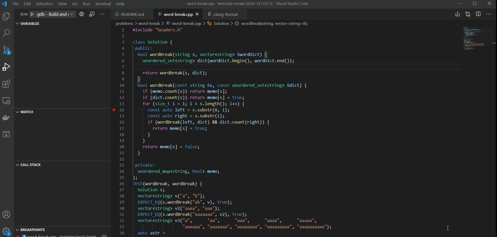

# LeetCode CMake

> Leetcode CMake template. For easy building, testing, and debugging with CMake, GTest, and VSCode.

## Requirements

- [CMake](https://cmake.org/)
- [GTest](https://github.com/google/googletest)
- GCC/Clang and make

Run `sudo apt install build-essential cmake libgtest-dev` to install in Ubuntu> 20.04

## Usage

Run `./new.sh <problem name>` to create a new problem directory in `problems`.

Every CPP file in this directory will be a **solution** to the problem and you can have several solutions for one problem.

Run `cmake .` then `make` in either top directory or problem directory to build either all or one problem.

It will compile a binary in the problem directory with the same name as the solution cpp file.

### `<F5>` One Press debug in Visual Studio Code

Once install the needed extensions on VSCode (`C/++`, `CMake Tools`) and debugger with mi support installed on your system, You can debug the currently active file with just a `<F5>`

# Credits

https://github.com/Pokerpoke/LeetCode
